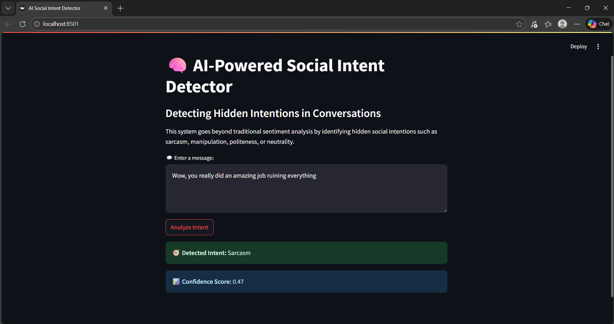

 🧠 AI-Powered Social Intent Detector

📌 Project Overview
The AI-Powered Social Intent Detector is a machine learning–based web application that analyzes user-input text and identifies the **social intent** behind the message.

Unlike basic sentiment analysis, this project focuses on detecting *how* something is said — such as sarcasm, politeness, manipulation, or neutrality.

The application is built using **Python, NLP techniques, and Streamlit** for an interactive user interface.

 📸 Demo

🎯 Detected Social Intents
The system classifies text into the following categories:
- **Sarcasm**
- **Polite**
- **Manipulative**
- **Neutral**

 🛠️ Technologies Used
- **Python**
- **Streamlit** – for building the web interface
- **Pandas** – for data handling
- **Scikit-learn**
  - TF-IDF Vectorizer
  - Logistic Regression classifier

 ⚙️ How the System Works
1. A small but valid dataset is created with sample sentences and labeled social intents.
2. Text data is converted into numerical form using **TF-IDF Vectorization**.
3. A **Logistic Regression** model is trained on the dataset.
4. Users enter a message through the Streamlit interface.
5. The model predicts:
   - The **social intent**
   - A **confidence score** for the prediction

📂 Project Structure
- `app.py` – Main application file containing:
  - Dataset creation  
  - Model training  
  - Streamlit UI  
  - Prediction logic  

 ▶️ How to Run the Project
1. Clone the repository:
git clone https://github.com/Shalinips/ai-powered-social-intent-detector.git

2. Install required libraries:

3. Run the application:
streamlit run app.py

4. Open the browser link shown in the terminal.

💡 Use Cases
- Understanding hidden intent in social media comments
- Detecting sarcasm or manipulation in conversations
- Educational demonstration of NLP and ML concepts
- Beginner-friendly AI/NLP project for academic use

 👩‍💻 Author
**Shalini P S**

 ⭐ Future Enhancements
- Larger and real-world datasets
- More intent categories
- Deep learning–based intent detection
- Support for multiple languages

